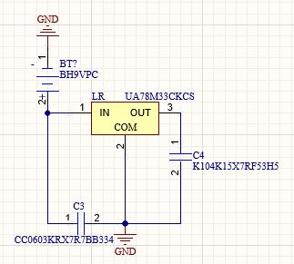

# :beginner: Introduction
- This project is the final project for the two courses, Introduction to Embedded Systems (IES) as well as Electronics I at Rowan University designed by Keiane Balicanta, Andrew McGlynn, and David Miller.


## :ledger: Index

- [:beginner: Introduction](#beginner-introduction)
  - [:ledger: Index](#ledger-index)
  - [:computer: Embedded Systems](#computer-embedded-systems)
  - [:zap: Electronics](#zap-electronics)
  - [:electric\_plug: Installation](#electric_plug-installation)
  - [:wrench: Materials](#wrench-materials)
    - [:nut\_and\_bolt: Dependencies](#nut_and_bolt-dependencies)
  - [:question: Issues](#question-issues)
  - [:page\_facing\_up: Resources](#page_facing_up-resources)
  - [:camera: Gallery](#camera-gallery)
  - [:star2: Credit/Acknowledgment](#star2-creditacknowledgment)
    - [:mortar_board: Instructors](#instructors)
    - [:school_satchel: Students](#students)

##  :computer: Embedded Systems
The major requirements for this project require the implementations:
- **Standalone System**
  - In Altium Designer, we have redesigned a standalone version of the MSP430FR2355 board to suit the needs of the chess board. The MSP430FR2355 standalone board as well as a chess board PCB that contains the LEDs and reed switches. To control the LEDs and switches, 2 16-bit shift registers (1 input/SIPO and 1 output/PISO) were used to control the LEDs and switches rather than using an LED matrix.
- **Sensing**
  - Reed switches activated by neodynium magnets
- **Actuating**
  - Green LEDs are emitted corresponding to the respective reed switch being activated
- **Communicating**
  - An ESP8266 ESP01 Wi-Fi module is used to communicate wirelessly with the MSP430 to communicate data read back to the user

## :zap: Electronics
A 9V battery is going to be used through a linear regulator to drop the voltage to 5V and 3.3V to deliver power to the MSP430 board.

## :electric\_plug: Installation
Below are the Altium Schematics of how connections were made for the WiFi module to the MSP, regulator, SIPO-to-LEDs, and PISO-to-switches. Connecting the MSP to the SIPO-LED shift register is defined in the code comments, lines 8-13 in the `main.c` file.

Note that this does not reflect code for the PISO shift register, only the SIPO shift register. Please refer to the datasheets in the Resource section to implement it.
```
#define CS BIT1 //   P1.1 -> chip-level disables register clock and storage register clock
#define SHCLK BIT2 //   P1.2 -> shift register clock
#define RW BIT3 //   P1.3 -> read/write
#define STRCLR BIT4  //   P1.4 -> storage clear
#define STRCLK BIT5   //   P1.5 -> storage clock
#define SERIAL BIT6   //   P1.6 -> q15
```

A file `SN74LS164N_Code.c` is included in the project file. This was used to breadboard a prototype of working LEDs with an 8-bit shift regitster while we waited for parts to come in. It was excluded from the build once we started using the 16-bit register. The datasheet for this 8-bit register is part of the same datasheet as the 16-bit SIPO register as they are both part of the same component family.
### Pictures of Altium Schematics:





##  :wrench: Materials
| Item | Amount | Part Number | Description
| ------------ | ------------- | ------------- | ------------- |
| Reed Switches | x16 | MDSR-7-10-20 | Used with any neodynium magnets
| Green LEDs | x16 | LTL-4234 | Connected to 5V rail
| SIPO Shift Register | x1 | SN74LS673N | For LED control
| PISO Shift Register | x1 | SN54LS674J | For reed switch control
| Linear Regulator | x1 | UA78M33CKCS | Connects to 5V and 3.3V
| 330 nF Cap | x1 | CC0603KRX7R7BB334 | Regulator input capacitor
| 100 nF Cap | x1 | K104K15X7RF53H5 | Regulator output capacitor
|ESP8266 ESP01 Wi-Fi Module | x1 | WRL-17146 | WiFi connected to ThingSpeak

###  :nut_and_bolt: Dependencies
- The version of Code Composer Studio used is **Version: 12.2.0.00009**
#### Arduino
- Libraries
  - https://www.arduino.cc/reference/en/libraries/arduino-uno-wifi-dev-ed-library/

- Packages
  - http://arduino.esp8266.com/stable/package_esp8266com_index.json
  - https://dl.espressif.com/dl/package_esp32_index.json


## :question: Issues
- The MSP430 custom designed board does not deliver power. This was discovered during the testing of LEDs which the Altium board does not contain a trace connection to the 5V pin. The 3.3V pin does not work as this may be an issue from the regulator. The use of a development MSP board is needed.
- WiFi connection to ThingSpeak does not work due to time restraint of the project.
- The main.c file needs to be optimized to accurately represent chess moves by configuring the clock timings and inputs.

##  :page_facing_up: Resources
SIPO shift register datasheet:
- https://www.ti.com/general/docs/suppproductinfo.tsp?distId=26&gotoUrl=http%3A%2F%2Fwww.ti.com%2Flit%2Fgpn%2Fsn74ls673

PISO shift register datasheet:
- https://rocelec.widen.net/view/pdf/nydnrq5tbm/sn54ls673.pdf?t.download=true&u=5oefqw

In the `Arduino WiFi References` folder is a list of documents that was used to attempt to implement the Arduino ESP01 with ThingSpeak.

##  :camera: Gallery
### Pictures of Boards:


## :star2: Credit/Acknowledgment
### Instructors
- Russell Trafford, M.S. (IES)
- John Schmalzel, Ph.D. (Electronics)
- Jannatun Naher, Ph.D. (IES)
- Jochy Perez (Electronics)

### Students
- Keiane Balicanta
- Andrew McGlynn
- David Miller